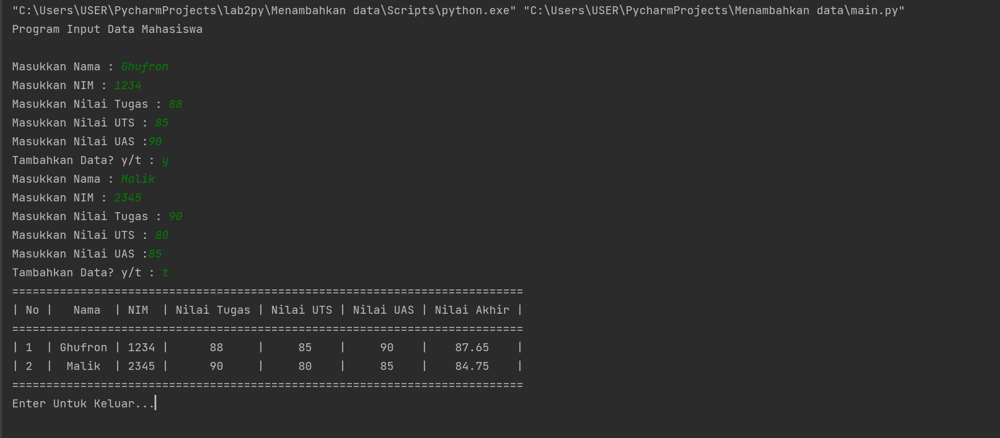

## Penjelasan

Berikut adalah tampilan program menggunakan bahasa Python


1. ```from prettytable import PrettyTable```
Membuat header table menggunakan **prettytable**. Variabel **import** berfungsi untuk memanggil file lain di dalam satu module yang berbeda.

2. `print("Program Input Data Mahasiswa")`
**print()** untuk menampilkan kalimat yang di input.

3. 
```py 
tabelNama = PrettyTable(["No" ,"Nama" ,"NIM" ,"Nilai Tugas" ,"Nilai UTS" ,"Nilai UAS" ,"Nilai Akhir" ])
a = 0
```
(Deklarasi list)untuk menginput data yang dimasukkan kedalam list. input **tabelNama** untuk memanggil.
sedangkan **PrettyTable** berfungsi untuk membungkus semua list.
Deklarasi `*a = 0*` untuk membuat nomor pada isi table.

4. Membuat program perulangan menggunakan
 ```py  while True: ```

5. ```py
    a += 1
    b = input("Masukkan Nama : ")
    c = input("Masukkan NIM : ")
    d = int(input("Masukkan Nilai Tugas : "))
    e = int(input("Masukkan Nilai UTS : "))
    f = int(input("Masukkan Nilai UAS :" ))
    g = "{:.2f}".format((d*.30) + (e*.35) + (f*.35))
    ```
`a += 1` untuk menginput nomer pada awal table.
deklarasi list dan Memasukkan Input Dengan Fungsi `input()` untuk menulis nama yang akan kita simpan dalam variabel.
`int(input())` untuk menginput tipe data interger (bilangan bulat) dalam variabel.

```{:.2f}".format((d*.30) + (e*.35) + (f*.35)) ```
untuk menginput **Nilai Akhir** yang di ambil dari perhitungan 3 komponen nilai.

6. ```py 
    tabelNama.add_ro ([a,b,c,d,e,f,g])
    tabelNama.horizontal_char = "="
    tabelNama.junction_char = "="
    variabel di atas adalah untuk membentuk sebuah table.
    ```
7. Program input tanya [y/t], apabila jawaban t atau T, maka program inputan dihentikan statement break dan akan menampilkan data yang sudah diinput.

### Output
Bila dijalankan maka program akan menghasilkan output seperti dibawah ini

